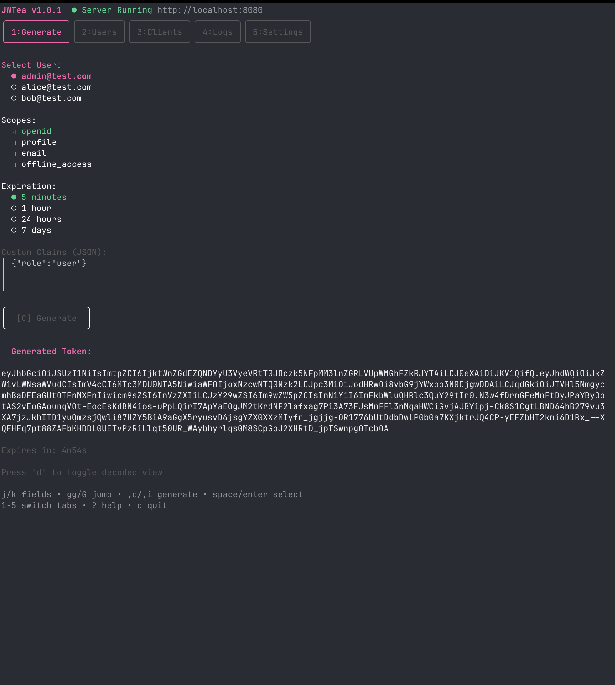

# JWTea

A lightweight OAuth2/OIDC Authorization Server with an interactive Terminal UI (TUI) dashboard for testing and development.



## Features

- **Full OAuth2/OIDC Server** - Authorization Code flow with PKCE support
- **Interactive TUI Dashboard** - Built with [Bubble Tea](https://github.com/charmbracelet/bubbletea)
- **RS256 JWT Tokens** - Fresh RSA keys generated on each startup
- **Token Introspection** - RFC 7662 compliant `/oauth2/introspect` endpoint
- **Token Revocation** - RFC 7009 compliant `/oauth2/revoke` endpoint
- **Built-in Callback UI** - Beautiful callback page for testing OAuth flows
- **Chaos Mode** - Inject failures for testing (expired tokens, invalid signatures)
- **Zero Configuration** - Works out of the box with sensible defaults
- **YAML Configuration** - Customize clients, users, scopes, and more

## Installation

### From Source

```bash
git clone https://github.com/yourusername/jwtea.git
cd jwtea
make build
```

### Go Install

```bash
go install github.com/yourusername/jwtea@latest
```

## Quick Start

```bash
# Start with default settings
./jwtea serve

# Start with custom config
./jwtea serve --config config.yaml

# Start on a different port
./jwtea serve --port 9000
```

The server starts at `http://localhost:8080` with the TUI dashboard.

## TUI Dashboard

The dashboard has 5 tabs, accessible via number keys `1-5`:

### 1. Generate Tab
Generate JWT tokens directly from the TUI:
- Select user, scopes, and expiration
- Add custom claims as JSON
- Copy tokens to clipboard
- View decoded token payload

**Keybindings:**
- `j/k` - Navigate fields
- `space` - Toggle options
- `,c` - Generate and copy token
- `d` - Toggle decoded view

### 2. Users Tab
Manage test users:
- View all configured users
- Add new users with email, role, and department
- Delete users

**Keybindings:**
- `a` - Add new user
- `d` - Delete selected user
- `j/k` - Navigate list

### 3. Clients Tab
Manage OAuth clients:
- View client IDs and redirect URIs
- Add new clients with secrets
- Delete clients

**Keybindings:**
- `a` - Add new client
- `d` - Delete selected client
- `j/k` - Navigate list

### 4. Logs Tab
Real-time HTTP request logs:
- Filter by errors only
- Auto-follow new requests
- View request details

**Keybindings:**
- `enter` - View request details
- `c` - Copy request path
- `f` - Toggle auto-follow
- `e` - Toggle errors-only filter
- `j/k` - Navigate logs
- `/` - Filter logs

### 5. Settings Tab
Configure chaos mode for testing:
- Simulate 500 errors
- Generate expired tokens
- Create tokens with invalid signatures

**Global Keybindings:**
- `1-5` - Switch tabs
- `?` - Toggle help
- `q` - Quit

## API Endpoints

| Endpoint | Description |
|----------|-------------|
| `GET /.well-known/openid-configuration` | OIDC Discovery |
| `GET /jwks.json` | JSON Web Key Set |
| `GET /authorize` | OAuth2 Authorization |
| `POST /oauth2/token` | Token Exchange |
| `POST /oauth2/introspect` | Token Introspection (RFC 7662) |
| `POST /oauth2/revoke` | Token Revocation (RFC 7009) |
| `GET /callback` | Built-in callback UI |
| `GET /healthz` | Health check |

## OAuth2 Flow Example

### 1. Authorization Request

```
http://localhost:8080/authorize?
  response_type=code&
  client_id=demo-client&
  redirect_uri=http://localhost:8080/callback&
  scope=openid%20profile%20email&
  state=random-state
```

### 2. Token Exchange

```bash
curl -X POST http://localhost:8080/oauth2/token \
  -u demo-client:demo-secret \
  -d "grant_type=authorization_code" \
  -d "code=<authorization_code>" \
  -d "redirect_uri=http://localhost:8080/callback"
```

### 3. Token Introspection

```bash
curl -X POST http://localhost:8080/oauth2/introspect \
  -u demo-client:demo-secret \
  -d "token=<access_token>"
```

### PKCE Flow

```bash
# Generate code verifier and challenge
CODE_VERIFIER=$(openssl rand -base64 32 | tr -d '=+/' | cut -c1-43)
CODE_CHALLENGE=$(echo -n $CODE_VERIFIER | openssl sha256 -binary | base64 | tr -d '=' | tr '/+' '_-')

# Authorization request with PKCE
http://localhost:8080/authorize?
  response_type=code&
  client_id=demo-client&
  redirect_uri=http://localhost:8080/callback&
  code_challenge=$CODE_CHALLENGE&
  code_challenge_method=S256

# Token exchange with verifier
curl -X POST http://localhost:8080/oauth2/token \
  -d "grant_type=authorization_code" \
  -d "client_id=demo-client" \
  -d "code=<authorization_code>" \
  -d "redirect_uri=http://localhost:8080/callback" \
  -d "code_verifier=$CODE_VERIFIER"
```

## Configuration

Create a `config.yaml` file (see `config.example.yaml` for all options):

```yaml
server:
  port: 8080
  host: localhost

oauth:
  issuer: http://localhost:8080
  auth_code_expiry: 10m
  supported_scopes:
    - openid
    - profile
    - email

tokens:
  access_token_expiry: 5m
  refresh_token_expiry: 24h
  algorithm: RS256

users:
  - email: alice@test.com
    role: user
    dept: engineering
  - email: admin@test.com
    role: admin

clients:
  - id: demo-client
    secret: demo-secret
    redirect_uris:
      - http://localhost:8080/callback
      - https://oauth.pstmn.io/v1/callback

callback_server:
  enabled: true
  path: /callback

introspection:
  enabled: true
  require_client_auth: true

revocation:
  enabled: true
  require_client_auth: true
```

## Environment Variables

Override any configuration with `JWTEA_` prefix:

```bash
JWTEA_SERVER_PORT=9000
JWTEA_SERVER_HOST=0.0.0.0
JWTEA_OAUTH_ISSUER=https://auth.example.com
```

## CLI Options

```bash
jwtea serve [flags]

Flags:
  --config string     Path to YAML config file
  --host string       Host to bind (default "127.0.0.1")
  --port int          Port to bind (default 8080)
  --issuer string     OIDC issuer URL
  --log-buffer int    Log buffer size (default 500)
```

## Development

```bash
# Run with hot reload (requires air)
air

# Run tests
make test

# Run linter
make lint

# Build binary
make build

# Run with dev config
make run
```

## Architecture

```
jwtea serve
    │
    ├── HTTP Server (net/http)
    │   ├── /authorize           OAuth2 authorization
    │   ├── /oauth2/token        Token endpoint
    │   ├── /oauth2/introspect   Token introspection
    │   ├── /oauth2/revoke       Token revocation
    │   ├── /.well-known/...     OIDC discovery
    │   ├── /jwks.json           Public keys
    │   └── /callback            Built-in callback UI
    │
    └── TUI Dashboard (Bubble Tea)
        ├── Generate             Create tokens
        ├── Users                Manage users
        ├── Clients              Manage clients
        ├── Logs                 HTTP request logs
        └── Settings             Chaos mode toggles
```

## Use Cases

- **Local Development** - Test OAuth2 integration without external dependencies
- **API Testing with Postman** - Use as OAuth2 provider for Postman collections
- **API Testing with Bruno** - Configure as authorization server for Bruno requests
- **CI/CD Testing** - Spin up a mock auth server for integration tests
- **Demo Environments** - Quick OAuth2 server for demos and prototypes
- **Learning OAuth2** - Interactive way to understand OAuth2/OIDC flows
- **Chaos Testing** - Test how your app handles auth failures

## Postman & Bruno Integration

### Postman

1. In your collection, go to **Authorization** tab
2. Select **OAuth 2.0** as type
3. Configure:
   - **Auth URL**: `http://localhost:8080/authorize`
   - **Access Token URL**: `http://localhost:8080/oauth2/token`
   - **Client ID**: `demo-client`
   - **Client Secret**: `demo-secret`
   - **Callback URL**: `https://oauth.pstmn.io/v1/callback`
   - **Scope**: `openid profile email`
4. Click **Get New Access Token**

### Bruno

1. In your request, go to **Auth** tab
2. Select **OAuth 2.0**
3. Configure:
   - **Grant Type**: `Authorization Code`
   - **Authorization URL**: `http://localhost:8080/authorize`
   - **Token URL**: `http://localhost:8080/oauth2/token`
   - **Client ID**: `demo-client`
   - **Client Secret**: `demo-secret`
   - **Callback URL**: `http://localhost:8080/callback`
   - **Scope**: `openid profile email`
4. Click **Get Access Token**

> **Tip**: The Postman callback URL `https://oauth.pstmn.io/v1/callback` is pre-configured in the default config. For Bruno, use the built-in callback at `http://localhost:8080/callback`.

## License

MIT License - see [LICENSE](LICENSE) for details.
